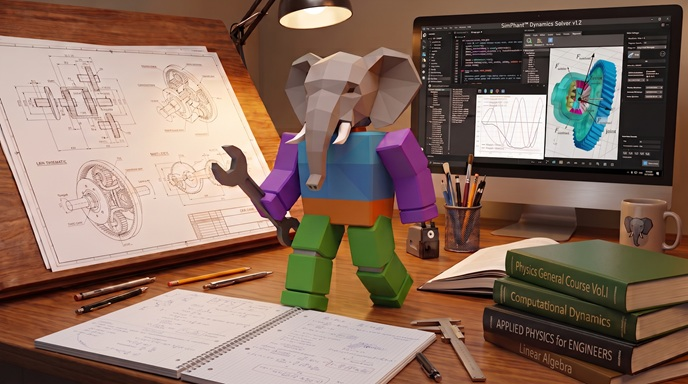

# SimPhant



SimPhant™ is an engineering-focused multibody dynamics (MBD) simulation environment for building, visualizing, and solving mechanical systems. It combines CAD-based geometry, rigid-body physics, constraints, forces, springs, contacts, gears, and motion definitions in a desktop application with an interactive 3D viewport.

## Quick Links

- Source repository: [SimPhant](https://github.com/valeriy-sh79/SimPhant)
- Windows releases: [GitHub Releases](https://github.com/valeriy-sh79/SimPhant/releases)
- Documentation website: [SimPhant Docs](https://valeriy-sh79.github.io/simphant-docs/)
- Documentation source: [simphant-docs](https://github.com/valeriy-sh79/simphant-docs)
- Bug reports and feature requests: [Issue tracker](https://github.com/valeriy-sh79/SimPhant/issues)

## Getting Started

For most users, the fastest way to start with SimPhant is:

1. Download the latest Windows package from [GitHub Releases](https://github.com/valeriy-sh79/SimPhant/releases).
2. Launch `SimPhant.exe`.
3. Open one of the bundled models from the [Examples](./Examples/) folder to explore how real mechanisms are modeled and simulated.

If you want to inspect the implementation, modify the solver, or contribute code, use the Python source edition instead.

## Features

- Interactive 3D visualization powered by PyVista and PyVistaQt
- Rigid-body creation from CAD meshes and procedural primitives
- Mass, center-of-gravity, inertia tensor, and principal-axis calculations
- Reference frames and body positioning tools
- Joints including fixed, spherical, revolute, cylindrical, prismatic, and planar joints
- Forces, torques, actuators, and electric motors
- Compression springs, torsion springs, and bushings
- Collision and contact handling with friction options
- Spur/helical, internal, and bevel gear constraints
- Kinematic motion functions for supported joints
- Multiple numerical solver and integration methods
- Simulation playback, telemetry, CSV export, and video export
- Project save/load support using `.mbd` files
- In-application logging and traceback output for desktop and packaged builds

## License

SimPhant™ is free and open-source software distributed under the GNU General Public License v3.0 (GPLv3). See [LICENSE.txt](./LICENSE.txt) for the full license text.

## Project Status

SimPhant is under active development. APIs, user-interface details, simulation features, and project-file formats may change between releases.

The source code is publicly available so users and contributors can inspect, use, modify, and share the software under the terms of the project license.

## Choose Your Edition

SimPhant is available in two forms:

1. **Windows executable edition** for users who want to launch SimPhant directly without installing Python or managing Python packages.
2. **Python source edition** for users who have Python installed and want to run, inspect, or develop the project from source.

Both editions provide the same core application and simulation features. Each edition also includes an [Examples](./Examples/) folder with ready-to-run `.mbd` reference models. The Windows executable edition is the recommended option for users who only want to run SimPhant.

## Windows Executable Edition

The Windows executable edition is intended for users who do not want to install Python. It is distributed as a packaged application containing the runtime, required dependencies, and bundled example models.

### Requirements

- Windows 10 or newer, 64-bit
- Graphics hardware and drivers capable of running the Qt/PyVista OpenGL viewport
- A downloaded SimPhant release package
- No separate Python installation required

### Installation

1. Download the latest Windows package from [GitHub Releases](https://github.com/valeriy-sh79/SimPhant/releases).
2. Extract the release `.zip` into a writable folder on your PC.
3. Open the extracted package. It includes `SimPhant.exe` and an [Examples](./Examples/) folder with sample `.mbd` models covering classical physical and engineering mechanisms.
4. Run `SimPhant.exe`.
5. If Windows SmartScreen shows a warning, confirm that the package came from the official SimPhant release page before choosing **More info** -> **Run anyway**.

### Launching SimPhant

The packaged build launches the same application as the Python source edition. Application logs and telemetry CSV exports are saved in the current project folder or in a user-defined working directory, if one is set. The bundled [Examples](./Examples/) models are immediately available after installation and can be used to explore reference mechanisms and learn how they are built in SimPhant.

### Recommended First Steps

1. Start SimPhant.
2. Open one of the bundled `.mbd` files from the [Examples](./Examples/) folder.
3. Run the model and inspect the scene, project tree, and telemetry workflow.
4. Use the public documentation site for guided explanations of the main modeling and simulation features.

### Executable Releases

All public Windows packages are published on the [SimPhant Releases page](https://github.com/valeriy-sh79/SimPhant/releases). Each release should provide the source snapshot and a downloadable Windows archive containing `SimPhant.exe`.

## Python Source Edition

### Requirements

- Python 3.11 or newer: Runs the SimPhant source code and supports the current NumPy and SciPy dependency versions.
- PySide6: Provides the desktop user interface and Qt application framework.
- PyVista and PyVistaQt: Provide 3D mesh visualization and the Qt-integrated rendering viewport.
- NumPy: Provides array, vector, and matrix operations used throughout the simulation engine.
- SciPy: Provides scientific algorithms, rotations, numerical utilities, and integration support.
- Trimesh: Provides CAD mesh processing, geometry operations, and solid-mesh calculations.
- Numba: Accelerates selected mathematical and physics calculations using just-in-time compilation.

Additional dependencies may be required depending on the enabled solver, CAD, boolean, and video-export features.

### Installation

1. Clone the repository:

   ```bash
   git clone https://github.com/valeriy-sh79/SimPhant.git
   cd SimPhant
   ```

2. Create and activate a virtual environment:

   ```powershell
   py -3.11 -m venv .venv
   .\.venv\Scripts\Activate.ps1
   ```

3. Install the required packages:

   ```bash
   python -m pip install --upgrade pip
   pip install -r requirements.txt
   ```

4. The repository includes an [Examples](./Examples/) folder with ready-to-run `.mbd` models that can be opened immediately as learning and reference examples.
5. Keep the `icons` folder, [main_window.ui](./main_window.ui), and [ui_main_window.py](./ui_main_window.py) next to the Python modules when running from source.

### Running From Source

Start the desktop application from the repository root:

```bash
python main.py
```

When launched from source, SimPhant saves application logs and telemetry CSV exports in the current project folder or in a user-defined working directory, if one is set.

If you change the Qt Designer form, regenerate [ui_main_window.py](./ui_main_window.py) from [main_window.ui](./main_window.ui) before launching the application again.

## Usage

For full usage guidance, see the [SimPhant documentation website](https://valeriy-sh79.github.io/simphant-docs/). The guides cover importing CAD models, creating primitives, defining reference frames and constraints, configuring solver settings, running simulations, reviewing telemetry, and exporting results. The bundled [Examples](./Examples/) directory provides reference models that users can open immediately after installation.

Suggested starting examples include:

- `Newtons_Cradle.mbd`
- `Gyroscope.mbd`
- `Differential.mbd`
- `Universal_Cardan_Joint_Aligned.mbd`

## Project Files

SimPhant project states are stored as `.mbd` files. The public [Examples](./Examples/) folder contains ready-to-run reference models for classical physical and engineering mechanisms, so users can inspect how they are built in SimPhant immediately after installation. Private development save files and historical internal versions are maintained locally by the maintainer and are intentionally excluded from this public repository.

## Development

The main application controller is located in `main.py`. Supporting modules contain the rigid-body model, mathematical kernels, solver, integrators, geometry generators, forces, joints, springs, contacts, gears, project management, and telemetry functionality.

The Qt Designer source is `main_window.ui`. The generated `ui_main_window.py` file should be regenerated from the `.ui` file when the interface changes.

## Documentation

User documentation is maintained in a separate Docusaurus repository:

- Public website: [SimPhant Docs](https://valeriy-sh79.github.io/simphant-docs/)
- Docs source repository: [simphant-docs](https://github.com/valeriy-sh79/simphant-docs)

The documentation site contains the user guide, feature notes, and multilingual documentation content for English, Russian, and Ukrainian users.

## Support

Please use the [SimPhant issue tracker](https://github.com/valeriy-sh79/SimPhant/issues) for bug reports, installation problems, and feature requests. When reporting a problem, include the SimPhant version, operating system, reproduction steps, and any traceback or screenshots that help explain the issue.

## Contributing

Contributions are welcome through GitHub pull requests.

1. Fork the [SimPhant repository](https://github.com/valeriy-sh79/SimPhant).
2. Create a feature or fix branch from `develop`.
3. Test your changes locally before submitting.
4. Open a pull request back to `develop` and describe the motivation, scope, and validation results.

Documentation fixes can be submitted through the [simphant-docs repository](https://github.com/valeriy-sh79/simphant-docs) in the same way.

## Author

Valeriy Shapovalov

- GitHub: [valeriy-sh79](https://github.com/valeriy-sh79)
- LinkedIn: [Valeriy Shapovalov](https://www.linkedin.com/in/valeriy-shapovalov-9762a098/)
